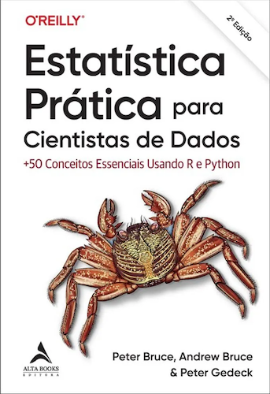

[](https://www.python.org/downloads/)


# Code repository
<table width='100%'>
 <tr>
  <td></td>
  <td>
   <p><b>Practical Statistics for Data Scientists:</b></p>

   <p>50+ Essential Concepts Using R and Python<br>
by Peter Bruce, Andrew Bruce, and <a href="https://www.amazon.com/Peter-Gedeck/e/B082BJZJKX/?&_encoding=UTF8&tag=petergedeck-20&linkCode=ur2&linkId=089cd2d466348aa1e598aab0a42aa207&camp=1789&creative=9325">Peter Gedeck</a></p>

   <ul>
    <li>Publisher: <a href="https://oreil.ly/practicalStats_dataSci_2e">O'Reilly Media</a>; 2nd edition (June 9, 2020)</li>
   <li>ISBN-13: 978-1492072942</li>
    <li>Buy on 
     <a href="https://www.amazon.com/Practical-Statistics-Data-Scientists-Essential/dp/149207294X?&_encoding=UTF8&tag=petergedeck-20&linkCode=ur2&linkId=71ac36e6b2d734c5dc9d7d432a1a860c&camp=1789&creative=9325">Amazon</a></li>
   <li>Errata: <a href="http://oreilly.com/catalog/errata.csp?isbn=9781492072942">http://oreilly.com/catalog/errata.csp?isbn=9781492072942</a></li>
   </ul>
    </td>
  </tr>
</table>


## Online
View the notebooks online:
[](https://nbviewer.jupyter.org/github/gedeck/practical-statistics-for-data-scientists/tree/master/)

Excecute the notebooks in Binder:
[](https://mybinder.org/v2/gh/gedeck/practical-statistics-for-data-scientists/HEAD)

 This can take some time if the binder environment needs to be rebuilt.

## Other language versions
<table>
  <tr>
    <td></td>
    <td><b>English:</b><br>
     Practical Statistics for Data Scientists: 50+ Essential Concepts Using R and Python<br>
     2020: ISBN 149207294X<br>
     <a href='https://www.google.com/books/edition/Practical_Statistics_for_Data_Scientists/F2bcDwAAQBAJ?hl=en'>Google books</a>,
     <a href="https://www.amazon.com/Practical-Statistics-Data-Scientists-Essential/dp/149207294X?&_encoding=UTF8&tag=petergedeck-20&linkCode=ur2&linkId=01266bb457a44268bc7efdb80d6c7312&camp=1789&creative=9325">Amazon</a>
    </td>
  </tr>

  <tr>
    <td></td>
    <td><b>Japanese (2020-06-11):</b><br>
     データサイエンスのための統計学入門 第2版 ―予測、分類、統計モデリング、統計的機械学習とR/Pythonプログラミング <br>
     2020: ISBN 978-4-873-11926-7,
     Shinya Ohashi (supervised), Toshiaki Kurokawa (translated), O'Reilly Japan Inc.<br>
     <a href='https://www.google.com/books/edition/%E3%83%87%E3%83%BC%E3%82%BF%E3%82%B5%E3%82%A4%E3%82%A8%E3%83%B3%E3%82%B9%E3%81%AE%E3%81%9F%E3%82%81%E3%81%AE%E7%B5%B1/d7EJzgEACAAJ?hl=en'>Google books</a>,
     <a href='https://www.amazon.co.jp/%E3%83%87%E3%83%BC%E3%82%BF%E3%82%B5%E3%82%A4%E3%82%A8%E3%83%B3%E3%82%B9%E3%81%AE%E3%81%9F%E3%82%81%E3%81%AE%E7%B5%B1%E8%A8%88%E5%AD%A6%E5%85%A5%E9%96%80-%E2%80%95%E4%BA%88%E6%B8%AC%E3%80%81%E5%88%86%E9%A1%9E%E3%80%81%E7%B5%B1%E8%A8%88%E3%83%A2%E3%83%87%E3%83%AA%E3%83%B3%E3%82%B0%E3%80%81%E7%B5%B1%E8%A8%88%E7%9A%84%E6%A9%9F%E6%A2%B0%E5%AD%A6%E7%BF%92%E3%81%A8R-Python%E3%83%97%E3%83%AD%E3%82%B0%E3%83%A9%E3%83%9F%E3%83%B3%E3%82%B0-Peter-Bruce/dp/487311926X'>Amazon</a>,
     <a href='https://www.oreilly.co.jp/books/9784873119267/'>Order here</a>
    </td>
  </tr>

  <tr>
    <td></td>
    <td><b>German (2021-03-29):</b><br>
     Praktische Statistik für Data Scientists: 50+ essenzielle Konzepte mit R und Python <br>
     2021: ISBN 978-3-960-09153-0, Marcus Fraaß (Übersetzer), dpunkt.verlag GmbH<br>
     <a href='https://www.google.com/books/edition/Praktische_Statistik_f%C3%BCr_Data_Scientist/yeMCzgEACAAJ?hl=en'>Google books</a>,
     <a href='https://www.amazon.de/Praktische-Statistik-f%C3%BCr-Data-Scientists/dp/3960091532'>Amazon</a>
     <a href='https://dpunkt.de/produkt/praktische-statistik-fuer-data-scientists/'>Order here</a>
    </td>
  </tr>

  <tr>
    <td></td>
    <td><b>Korean (2021-05-07):</b><br>
     Practical Statistics for Data Scientists: 데이터 과학을 위한 통계(2판)<br>
     2021: ISBN 979-1-162-24418-0, Junyong Lee (translation), Hanbit Media, Inc.
     <br>
     <a href='https://www.google.com/books/edition/%EB%8D%B0%EC%9D%B4%ED%84%B0_%EA%B3%BC%ED%95%99%EC%9D%84_%EC%9C%84%ED%95%9C_%ED%86%B5%EA%B3%84_2%ED%8C%90/9E9qzgEACAAJ?hl=en'>Google books</a>,
     <a href='https://www.hanbit.co.kr/store/books/look.php?p_code=B2862122581'>Order here</a>
    </td>
  </tr>

  <tr>
    <td></td>
    <td><b>Polish (2021-06-16):</b><br>
     Statystyka praktyczna w data science. 50 kluczowych zagadnien w jezykach R i Python<br>
     2021: ISBN 978-8-328-37427-0, Helion
     <br>
     <a href='https://www.google.com/books/edition/Statystyka_praktyczna_w_data_science/GyqSzgEACAAJ'>Google books</a>,
     <a href="https://www.amazon.com/Statystyka-praktyczna-science-kluczowych-zagadnien/dp/8328374277/?&_encoding=UTF8&tag=petergedeck-20&linkCode=ur2&linkId=9cccbcaa580dac9d36976d8b69b66f7a&camp=1789&creative=9325">Amazon</a>,
     <a href='https://helion.pl/ksiazki/statystyka-praktyczna-w-data-science-50-kluczowych-zagadnien-w-jezykach-r-i-python-wydanie-ii-peter-bruce-andrew-bruce-peter-gedeck,stpra2.htm'>Order here</a>
    </td>
  </tr>

  <tr>
    <td></td>
    <td><b>Russian (2021-05-31):</b><br>
     Практическая статистика для специалистов Data Science, 2-е изд.<br>
     2021: ISBN 978-5-9775-6705-3, BHV St Petersburg
     <br>
     <a href='https://www.google.com/books/edition/%D0%9F%D1%80%D0%B0%D0%BA%D1%82%D0%B8%D1%87%D0%B5%D1%81%D0%BA%D0%B0%D1%8F_%D1%81%D1%82%D0%B0%D1%82%D0%B8%D1%81%D1%82/l_6MDwAAQBAJ'>Google books</a>,
     <a href='https://bhv.ru/product/prakticheskaya-statistika-dlya-spetsialistov-data-science-2-e-izd/'>Order here</a>
    </td>
  </tr>

  <tr>
   <td></td>
   <td><b>Chinese complex (2021-07-29):</b><br>
    Practical Statistics for Data Scientists: 資料科學家的實用統計學 第二版<br>
    2021: ISBN 978-9-865-02841-1, Hong Weien (translation), GoTop Information Inc.
    <br>
    <!-- <a href='https://www.google.com/books/edition/'>Google books</a>, -->
    <a href='http://books.gotop.com.tw/o_A643'>Order here</a>
  </td>

  </tr>
   <tr>
    <td></td>
    <td><b>Chinese simplified (2021-10-15):</b><br>
     Practical Statistics for Data Scientists: 数据科学中的实用统计学（第2版）<br>
     2021: ISBN 978-7-115-56902-8, Chen Guangxin (translation), Posts & Telecom Press
     <br>
     <!-- <a href='https://www.google.com/books/edition/'>Google books</a>, -->
     <a href='https://item.jd.com/12971155.html'>Order here</a>
    </td>
  </tr>
  <tr>
    <td></td>
    <td><b>English (Indian subcontinent &amp; select countries only):</b><br>
     Practical Statistics for Data Scientists: 50+ Essential Concepts Using R And Python, Second Edition<br>
     2021: ISBN 978-8-194-43500-6, Shroff Publishers and Distributors Pvt. Ltd.
     <br>
     <!-- <a href='https://www.google.com/books/edition/'>Google books</a>, -->
     <a href='https://www.shroffpublishers.com/books/9788194435006/'>Order here</a>
    </td>
  </tr>
  <tr>
    <td></td>
    <td><b>Spanish (2022-02-22):</b><br>
     Estadística práctica para ciencia de datos con R y Python, Second Edition<br>
     2022: ISBN 978-8-426-73443-3, Marcombo S.A.
     <br>
     <a href='https://books.google.com/books?id=IZxeEAAAQBAJ'>Google books</a>,
     <a href="https://www.amazon.com/Estad%25C3%25ADstica-pr%25C3%25A1ctica-ciencia-datos-Python/dp/842673443X/?&_encoding=UTF8&tag=petergedeck-20&linkCode=ur2&linkId=6946ee487a7aeee619508c0ca6aa25f4&camp=1789&creative=9325">Amazon</a>,
     <a href='https://www.marcombo.com/estadistica-practica-para-ciencia-de-datos-con-r-y-python-9788426734433/'>Order here</a>
    </td>
  </tr>
  <tr>
    <td></td>
    <td><b>Portuguese (2025-10-30):</b><br>
     Estatística prática para cientistas de dados<br>
     2025: ISBN 978-8-550-82651-6 978-8-426-73443-3, Alta Books Editora
     <br>
     <!-- <a href='https://books.google.com/books?id=IZxeEAAAQBAJ'>Google books</a>,
     <a href="https://www.amazon.com/Estad%25C3%25ADstica-pr%25C3%25A1ctica-ciencia-datos-Python/dp/842673443X/?&_encoding=UTF8&tag=petergedeck-20&linkCode=ur2&linkId=6946ee487a7aeee619508c0ca6aa25f4&camp=1789&creative=9325">Amazon</a>, -->
     <a href='https://www.martinsfontespaulista.com.br/estatistica-pratica-para-cientistas-de-dados-1157971/p'>Order here</a>
    </td>
  </tr>
</table>


## See also
- The code repository for the first edition is at: <a href="https://github.com/andrewgbruce/statistics-for-data-scientists">https://github.com/andrewgbruce/statistics-for-data-scientists</a>


# Setup of R and Python environments

We recommend using a conda environment to run the Python and R code.

```
conda create -n sfds #Create the conda environment named sfds.
conda activate sfds #Activate the environment we created.
conda env update -n sfds -f environment.yml #Update the depencies of the environment from environment.yml 
```

The full list of Python and R dependencies from the [environment.yml](environment.yml) file:

```
python
jupyter
pandas
matplotlib
scipy
statsmodels
wquantiles
seaborn
scikit-learn
pygam
dmba
pydotplus
imbalanced-learn
prince
xgboost
graphviz
numpy
adjustText
r-essentials
r-base
r-vioplot
r-corrplot
r-gmodels
r-matrixstats
r-lmperm
r-pwr
r-fnn
r-klar
r-dmwr
r-xgboost
r-ellipse
r-mclust
r-ca
r-ggplot2
r-irkernel
r-boot
r-randomforest
```
